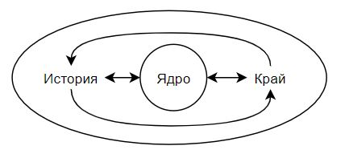
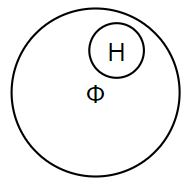
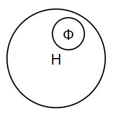
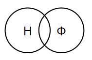

# Логика и методология науки

> 1 лк (11/09/2021)

## Наука как один из способов познания мира

1. Понятие знания, виды знания

2. Понятие науки

3. Аспекты бытия науки

Понятие знание шире понятия науки

Проблему знания изучал Сократ

Рабочее определение знаний - отражение действительности в сознании человека в виде представлений, понятий, суждений, теорий

### Классификация видов знаний

- Донаучное - не достигает уровня теории, существует на уровне народного мировоззрения

- Антинаучное - отрицающее все исторические достижения науки (Н: антидарвинизм, плоскоземельцы)

- Ненаучное - религиозные верования, мифологические образы, художественные образы, магия и колдовство

- Псевдонаучное - обилие научной терминологии и апелляция к авторитетам, но отрицаются научные данные

- Научное

Наука перевод:

- mathema - греки

- scientia - римляне

Наука рассматривается в двух планах:

1. Исторический
   1. Древневосточная преднаука
   2. Античная
   3. Средневековая - комментарии к библейским текстам или текстам Аристотеля
   4. Классическая (17-18 в.)
   5. Неклассическая
   6. Пост-неклассическая
2. Методологический
   1. (академик Стёпин) "Наука - это то, чем занимаются учёные"
   2. Марксистское определение - форма общественного сознания (форма культуры), дающая адекватное представление о реальности
   3. Пост-позитивизм - (К.Р. Поппер) система высказываний, высказывание научно, если оно в принципе опровержимо

Наука может пониматься как:

- Форма культуры

- Тип знания

- Форма деятельности

- Социальный институт

Онтология науки:

1. Жёсткое ядро науки
2. История науки
3. Передний край научных исследований

### Наука как определённый тип знаний

У науки есть определённые границы, не всё должно становиться её объектом

Цель науки - приращение научного знания

#### Критерии науки:

- Объективность - отвлечение от интересов познающего субъекта и всего сверхприродного
- Доказательность и обоснованность - эмпирические факты и логические рассуждения
- Рациональность - подводятся основания для утверждений
- Проверяемость и воспроизводимость
- Способность к развитию
- Системность - система от понятий до теорий
- Обращённость к сущности (не к явлениям)

### Наука как форма деятельности

Наука - исторически сложившаяся форма деятельности по познанию и преобразованию мира

Деятельность - любое проявление социальной активности

Любая деятельность включает в себя следующие элементы:

- Цель - получение знаний

- Продукт - знание, методологический инструментарий, нравственные ценности, научный стиль рациональности

- Средства - эмпирические и теоретические методы, научный язык, использование математики, использование установок и приборов

- Объект - природа, общество, человек, культура, техника

- Субъект - отношение между людьми: коллегами, учитель - ученик

### Наука как социальный институт

Наука является определённой организацией, которая прошла эволюцию

Как институт складывается в 16-17 в. при осознании значимости наука для человека

Этапы организации науки:

1. Республика учёных (17 в.) - переписка между Декартом, Лейбницем, Локком, отличается энциклопедизм (обращение ко всему, без специализации)
2. Дисциплинарная организация (18 в.) - в форме научных статей, дисциплинарная ориентированность на конкретную область
3. Междисциплинарная организация (середина 20 в.) - учёный как профессия

Профессионал не обязательно знает всё, но избегает грубых ошибок в своей области

Нормы научной деятельности - (Р.К. Мертон) этос науки:

1. Универсальность - познание не зависит от познающего
2. Общность (коммунизм) - достояние человечества
3. Бескорыстие
4. Организованный скептицизм - ответственность за работу других учёных

> 2 лк (25/09/2021)

## Соотношение науки с другими способами познания

### Наука и миф

Миф — форма осознания мира и способ его понимания, характерный для ранних стадий общественного развития.

черты мифа:

1. универсализм
2. антропоморфность — очеловечивание.
3. синкретизм.
4. Иррациональность.

Алексей Фёдорович Лосев — русский философ.
Наука не рождается из мифа, но наука содержит в себе элемент мифологичности.
Элемент мифологичности как пример "никаких пространств кроме евклидового не существует". А потом пришел лобачевский и доказал обратное.

Миф не является выдумкой. Он — предмет непосредственного восприятия мира.

Миф не дает научно-истинного знания. Но миф сплачивает общество, регулирует поведение его членов. В этом плане мифология сохраняется и сегодня — социальная мифология (полит-мифология).

В отличие от мифологии наука — рациональная форма познания на опред этапе. Ratio, рациональная форма познания возникла в форме философии.

Научно-философское мышление формируется примерно в 6 веке до н.э. 
Карл Ясперс — немецкий философ называет это ^ время осевым временем. Почему? — в китае был лао дзы (основатель даосизма) и конфуций в это время.
В Персии был заратустра, а в Индии — будда, а в Израиле — пророки, В Греции — пифагор, парменид. Возникают первые философские систмы и рациональность.

Рациональный подход к миру:

- задачи познания
- открытия объективных закономерностей, а не прорицание божественной воли
- Знание должно опираться на опыт и логику
  Наука аккумулирует всё накопленное знание, а миф сменяет миф без наследования смысла и символики.

### Наука и религия

религия как способ познания.

Религия — форма общественного сознания, основанная на вере в сверхестественное.

Гегель считал религию способом познания.
Большинство авторов не считают религию способом познания.

Мифология и религия не тождественны.
В любой религии всегда есть мифология. А в мифологии не всегда есть религия. Мифология шире, чем религия.

Основные этапы:

1. первобытные религии
2. политеизм
3. монотеизм 

религия дает знания о правилах поведения.

отношения науки и религии носят исторический характер.

происходит онаучивание всех сфер кроме религии. Понимание бога:

1. теизм — бог на троне, как король.
2. деизм — бог первопринцип мира, создавший его, но не вмешивающийся в его развитие.
3. современное понимание бога — бог как информационный процесс.

### Наука и искусство

Искусство — форма общественного сознания, отражающая мир с помощью художественных образов.
Основная функция искусства — познавательная.

Наука познает мир теоретически, с помощью понятий, она рациональна.
Искусство отражает мир эстетически, с помощью художественных образов, в чувственной неповторимости единичных предметов, 
Искусство действует через воспитание человеческих чувств.

Пересечение науки и искусства порождает эстетику — науку о прекрасном.

### Наука и философия

Две точки зрения на природу философии:

1. философия — это не наука, это отдельная форма мировоззрения или общественного сознания.
   Философия (по Расселу) — это ничейная земля между наукой, религией и здравым смыслом.
   Основания (по А. Л. Никифорову):
- верификационный критерий — философия не стремится к подтверждению своих идей.
- фальсификационный критерий — философия не стремится к проверке своих идей.
- парадигмальный критерий — в философии нет одной общезначимой теории.
2. философия — это наука о наиболее общих законах природы, общества и человеческого мышления.
   Основания:
- у философии есть свой предмет — всеобщее свойство мира.
- у философии есть своя система понятий — категории философии.
- философия открывает наиболее общие законы развития мира — законы диалектики

из всего етого следует то, что вот она наука, то она в общем ну у неё есть своя специфика как у любой науки.

Модели соотношения философии и науки:

> 3 лк (9/10/2021)

1. трансценденталистская - философия - царица наук
   
   

2. позитивистская - наука сама себе философия
   
   

3. антиинтеракционистская
   
   

4. диалектическая - наука даёт эмпирический базис, а философия - методологию
   
   

## Псевдонаука

**Лженаука**, псевдонаука, паранаука (около) - группа концепций идейно-гипотетического, теоретического и псевдо-теоретического характера, стремящихся к применению научной методологии к предметам ненаучного и вненаучного характера.

Причины распространения:

- (К.И. Абелев) Вмешательство ненаучных сил в естественных ход развития науки исходит от:
  
  - Идеологии
  
  - Власти
  
  - Денег
  
  - Публики

- Специфические причины:
  
  - Системный общественный кризис
  
  - Массовая утрата общественной ориентации
  
  - Устранение цензуры
  
  - Рассекречивание лженаучных изысканий
  
  - Безоглядная вера в чудо
  
  - Вина на учёных

- (В.С. Стёпин)
  
  - Внутренние - рассогласование процессов дифференциации и интеграции знания
    Феномен профессионального идиотизма - узконаправленный специалист рассуждает о незнакомых областях
  
  - Внешние причины экспансии - общество потребления

Опасности лженауки:

- Утрата интереса к науке приводит к её остановке

- Затратность в денежном смысле

- Не может быть действительного прорыва

- Угроза здоровью и жизни человека

- Основа рассовых и националистических предрассудков в социальной области

Проявления лженауки в области техно-знаний:

- Гравицапа

- SETI - доказательства вмешательства инопланетян в нашу жизнь

### Сравнение критериев науки и паранауки

(Дж. Холтон)

| Наука                                                         | Паранаука                       |
| ------------------------------------------------------------- | ------------------------------- |
| Объективность                                                 | Низкий статус объективности     |
| Интерсубъективность - независимость от личности исследователя | Личностный характер результатов |
| Воспроизводимость                                             | Уникальность                    |
| Рациональность                                                | Вера                            |
| Опытная подтверждаемость                                      | Авторитет                       |

(В.Б. Губин) Существенные признаки лженауки:

- Резко сниженная самокритика;

- Плохая ориентация в критериях правильности научной теории;

- Обрывочные представления о современном состоянии научной мысли в области, в которой "работают" лжеучёные;

- Нелогичность рассуждений;

- Неверное понимание роли математики в построении формальной модели действительности;

- Отсутствие исторического взгляда на проблему.

### Классификация лженаук

(С.Н. Савинов)

- Религиозно-мифологические лжеучения: религия, уфология (аналог религии);

- Философско-пророческие лжеучения: каббала, био-энерго-информатика, астрология;

- Психологические лженауки: телепатия, телекинез, ясновидение, левитация, парапсихология, экстрасенсорика;

- Целительские лженауки: нетрадиционная медицина, эзотерика, народное целительство, хилерство, гомеопатия;

- Физические лженауки: торсионные поля, микролептоны, машина времени, инерционный двигатель, антигравитация, вечный двигатель, волновые гены, учение о кристаллической структуре воды, искажение идей физического вакуума;

- Псевдоистория;

- Научные фальсификации: заведомо ложные знания и выводы, фальсификации результатов исследований;

- Бесперспективные концепции: теоретические выводы, которые были пересмотрены и опровергнуты, философия.

Пути противодействия лженауке:

- Фундаментализация образования;

- Популяризация научных открытия в СМИ.

Важнейшие открытия десятилетия:

- Тёмная материя генома;

- Новые методы космологии;

- Новые методы палеонтологии;

- Открытие воды на Марсе;

- Перепрограммирование клеток;

- Микробиом человека;

- Экзопланеты;

- Роль воспаления в хронических болезнях;

- Антропогенное потепление климата.

> 4 лк (23/10/2021)

## Структура научного познания

1. Уровни науки

2. Форма научного познания

3. Теория и её структура и функции

4. Закон как ключевой элемент теории

### Уровни науки

1. Эмпирический

2. Теоретический

3. Мета-теоретический - философская интерпретация научных открытий

|                | Эмпирический                                                   | Теоретический                             |
| -------------- | -------------------------------------------------------------- | ----------------------------------------- |
| Основа         | Чувственность                                                  | Рациональность                            |
| К чему обращён | К реально существующим объектам                                | Идеальный объект                          |
| Методы         | Наблюдение, сравнение, измерение, эксперимент                  | Идеализация, формализация, аксиоматизация |
| Результат      | Эмпирические обобщения, выведение эмпирических закономерностей | Теория                                    |

### Формы научного познания

Суть формы - выяснить, как происходит процесс научного познания

**Проблема** - фиксация неизвестного в пределах известного

Проблемы:

- Фундаментальные - теоретические

- Прикладные - технологические

Этапы:

#### Постановка проблемы

**Факт** - знание, истинность которого доказана

Свойства факта:

- Достоверность

- Инвариантность - независимость факта от системы, в которой он рассматривается

**Предположение** - форма знания, основанная на совокупности имперических фактов

**Интуиция** - способность быстрого разрешения какого-либо вида задач

**Гипотеза** - форма знания, носящая вероятностный и незавершённый характер

Условия существования гипотезы:

- Простота

- Непротиворечие имеющимся научным знаниям

- Непротиворечие законам природы

Варианты развития гипотезы:

- Самоотрицание

- Уточнение

- Рост до уровня теории

**Теория** - форма знания, носящая завершённый характер

Внутри теории сохраняется фиксация соответствующих законов

Теория является высшей формой научного знания

Структура теории:

1. Исходные основания - понятия, аксиомы

2. Идеальный объект

3. Логика теории с определёнными правилами и формами

4. Философские и ценностные основания и установки

5. Закон, совокупность которых составляет содержание теории

Функции теории:

- Синтетическая - совокупность знаний

- Объяснительная - как существует и развивается явление

- Предсказательная - как будет развиваться явление

- Методологическая - вырабатывается методологический инструментарий науки

- Практическая - основа для ...

(Поппер) Критерий относительной приемлемости теории - какую теория предпочесть? Та, которая сообщает наибольшее количество информации, имеет более глубокое содержание. Является логически более строгой. Обладает большей объяснительной и предсказательной силой. Может быть более точно проверена посредством сравнения предсказанных фактов с наблюдениями.

Теоретическая нагруженность факта:

- Факт не может быть сформулирован вне системы сложившихся понятий

- Факт должен быть истолкован, интерпретирован

- К факту примешиваются наши приметы, желания из-за ценностных ориентиров субъекта

### Законы

> Китай, Греция
> 
> Дао (даосизм...) (Лао Цзы) - некое представление о существующем порядке вещей, в который не нужно вмешиваться
> 
> Логос - закономерность
> 
> (Фома Аквинский) - закон - божественный промысел 
> 
> Джордано Бруно - закон природы
> 
> Рене Декарт
> 
> Субъективный идеализм - вносятся человеческим разумом в окружающую действительность
> 
> Объективный идеализм - мировой разум

**Закон** - существенная, устойчивая, необходимая, повторяющаяся связь между явлениями

Классификация законов:

- По формам движения материи
  
  - механические
  
  - физические
  
  - химические
  
  - биологические
  
  - социальные

- По широте действия
  
  - всеобщие
  
  - особенные
  
  - частные - либо на этапе общественного развития или в области природы

- Роли
  
  - основные
  
  - вспомогательные

- Месту в системе научного знания
  
  - эмпирические
  
  - теоретические

- По характеру предсказаний
  
  - динамические - рождены классической механикой, законы жёсткой детерминации. Работает в системах, состоящих из небольшого числа элементов.
  
  - статистические - рождены развитием экономики, квантовой физики. Работают в системах с большим числом элементов и носят вероятностный характер.

## Классификация наук

1. История классификации

2. Современные классификации

3. Специфика основных групп наук

Классификация наук - выявление взаимных связей наук на основе принципов координации и субординации и выражение связи в виде взаимного расположения.

Нужна для организации научной деятельности.

Первая классификация дана Аристотелем. Теоретические (физика, метафизика, математика), практические (этика и политика) и творческие (техника, искусство).

Ф. Бэкон классификация по способностям человека - исторические (память), поэтические (воображение) и на естественные (разуме).

Т. Гоббс - дедуктивные (аксиоматические теоретические) и индуктивные (опытные).

Конт - энциклопедический закон (закон иерархии) - науки нужно разделять по предметному принципу. Математика, физика, химия, биология, социология.

Энгельс - по формам движения материи. Механические, физические, химические, биологические, социальные.

Неокантианство - по отношению к человеку. О духе и о природе.

В. И. Вернадский - описание планеты и всего космоса.

### Современные классификации

Предметная:

1. Философские (Греция 6 век до н.э.). История, этика, эстетика...
   Первая наука с собственным предметом. Первый рациональный подход к миру. Плюралистичность, очень долгое развитие.

2. Логико-математические - формальная логика, математика
   Специфика в идеальности объекта. Нет эмпирического уровня. Несколько ступеней абстракции. Универсальность применения.

3. Естественные (16-17 в.) - физика, химия, биология, геология...
   Законы лежат в основе технических и социальных систем. Физика - аспекты фундаментальности (лингвистическая - для истолкования показания приборов нужен язык физики, эпистемологическая - положения физики не выводятся из других наук, онтологическая фундаментальность - физика занимается базисными основами бытия). Строится по законам корреспондентской истинности - соответствие содержания знания содержанию предмета. Отвечает на вопрос - как существует мир.

4. Технические (17-18 в.) - электротехника, нанотехнологии...
   Подходы к предмету тех. наук (тех. науки - прикладное естествознание; тех. науки выше естественных; тех. науки - науки о законах функционирования и развития технических систем). Строятся по законам эффективности, практицизма. Отвечает на вопрос - что может изготовить человек их жёсткого материала природы.

5. Социогуманитарные (19-20 в.) - экономика, история, психология...
   Типы соц. знания (соц. философское, соц. экономическое, гуманитарное). В обществе переплетается субъективное и объективное, идеальное и материальное. Гуманитарные науки имеют дело с неповторимыми индивидуальными событиями. Ценностный аспект важен. Между познающим и познаваемым есть посредник, большую роль играет процедура интерпретации. Малая степень формализации. 

По характеру решаемых задач:

1. Фундаментальные - открытие законов. Цель - Получение знаний о мире. Поиск истинного знания - самодовлеющая цель. Выявить и познать ещё не познанные характеристики объектов. Полученное знание - достояние исследователя. Знание рассматривается как верное отображение действительности.

2. Прикладные - воплощение в технологию. Цель - Предписания для производства вещей. Поиск истинного знания - инструментальная цель. Определённые практические результаты исследований. Знание - собственность общественных институтов. Адекватность знания выражена его соответствием конкретным условиям практической задачи.

## Метод и методология

1. Язык науки

2. Понятие метода и методологи

3. Эволюция научного метода

4. Классификация методов

5. Методы эмпирического и теоретического познания

### Язык науки

**Язык** - средство общения, самовыражения и познания

Группы языков:

- Естественные - сложились стихийно. Повседневная речь с этнической принадлежностью.
  
  - Недостатки:
    
    - Многозначность - источник ошибок
    
    - Громоздкость

- Искусственные - созданы специально для определённых целей. Язык науки. Однозначен.

Основные этапы:

- Платон - первая идея создания языка науки на основе математики

- Аристотель - ввёл символьные обозначения в формальной логике

- Франсуа Виет - предложил знаковые обозначения в области математики

- Далее появился язык химии, языки программирования...

### Понятие метода и методологии

**Метод** - (греч. путь к чему-либо) способ познания и практики. Совокупность правил, норм, средств...

**Методология** - совокупность методов \ учение о методах.

Аспекты:

- Объективно-содержательный - обусловленность метода предметом познания

- Операциональный - зависимость метода от субъекта познания (из-за разной компетентности людей)

- Праксиологический (учение о деятельности)
  
  - Свойство эффективности
  
  - Надёжности
  
  - Ясности
  
  - Конструктивности

Характерные признаки научного метода:

- Объективность

- Воспроизводимость

- Эвристичность - возможность поиска нового

- Необходимость

- Конкретность

### Эволюция научного метода

У греков возникло представление о методологии

Френсис Бэкон - основатель методологии естествознания. Как ставятся опыты и эксперименты с тремя таблицами:

- Присутствия

- Отсутствия

- Степеней и сравнений

Элиминативная индукция - индукция исключения.

Рене Декарт - основатель универсальной методологии. Предложил правило метода:

1. Истинное знание - ясное и отчётливое

2. Исследуемую проблему необходимо делить на составные части

3. Необходимо идти в познании от исследованного к неисследованному

4. Необходимо делать полные обзоры

Гегель и Маркс - основатели диалектической логики

### Современный научный метод

Принципы:

- Теоретико-познавательный принцип истинности и объективности

- Формально-логические принципы обоснованности, однозначности, непротиворечивости и полноты описания

- Эмпирические принципы соответствия фактам верифицируемости и фальсифицируемости

- Прагматические принципы объяснительной силы и технологической эффективности

### Классификация методов

- По роли и месту в процессе научного познания
  
  - Формальные и содержательные
  
  - Эмпирические и теоретические
  
  - Фундаментальные и прикладные
  
  - Методы исследования и изложения

- По содержанию изучаемой наукой объектов
  
  - Методы естествознания, технознания, гуманитарные и тд.

- По степени общности и широте применения
  
  - Универсальные - диалектика, метафизика, аналитический, интуитивный, феноменологический, герменевтический
  
  - Общенаучные - эмпирия и теория, конкретно научная методология (статистика, оптимизация, ИИ, факторный анализ)

Принципы диалектического метода:

- Объективность

- Всесторонность

- Конкретность

- Историзм

- Противоречия

### Методы эмпирического и теоретического познания

- Эмпирический уровень
  
  - Наблюдение - чувственное восприятие предмета на основании определённый теоретических соображений
  
  - Сравнение - чем больше различий, тем больше информации
  
  - Измерение - количественное определение предмета
  
  - Эксперимент - насильственное вмешательство познающего субъекта в познаваемый объект

- Теоретический
  
  - Идеализация - процедура, в результате которой реальный объект подменяется другим объектом, в котором те или иные закономерности приобретают простой вид
  
  - Формализация - выявление различных отношений безотносительно к их содержанию
  
  - Аксиоматизация - процедура, когда ряд положений, выделяющихся своей общностью и очевидностью, берётся в качестве логических посылок, недоказуемых в пределе данной теории

- Общелогические (на обоих уровнях и в повседневной практике)
  
  - Абстрагирование - отвлечение от свойств и отношений исследуемого объекта и от возможностей познающего субъекта
  
  - Анализ - выявление строения структуры объекта, отделение существенного от несущественного
  
  - Синтез - обнаружение общего и отдельного. Выявление соотношения сущности с конкретными формами её проявления
  
  - Индукция - частное к общему
  
  - Дедукция - общее к частному
  
  - Моделирование - изучение свойств реального объекта на специально созданном его аналоге
  
  - Исторический - раскрытие конкретных условий, частностей развития объекта
  
  - Логический - выяснение ролей элементов, которые составляют сущность развитого целого
